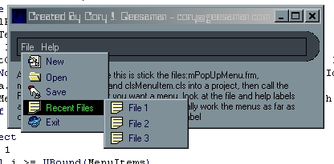



## Custom Menus \- A Must See

### Description

this took a little while to do, but the screenshot dosn't do it justice, i spent about 2 days on this and it is awsome, it will look exactly like an icq pop-up menu(if you right-click the description on the form you can see it), and it is also an easy way to add icons to menus, and to change the background and forecolor and highlight background/forecolors, this looks great and will be a part of my next app(GroupCode, which will be followed by AllCode - these two programs will have an opc client/server connection and i gaurantee you, they WILL change the way you program),i know that when a menu pops up it makes the parent form lose focus, if you have a way to fix this please help me and will post the updated code on psc and give you credit for the fix, please leave comments/bug reports/bug fixes/and votes
 
### More Info
 

             |
---                |---
**Submitted On**   |2001-11-02 18:40:20
**By**             |[Cory J\. Geesaman](https://github.com/Planet-Source-Code/PSCIndex/blob/master/ByAuthor/cory-j-geesaman.md)
**Level**          |Intermediate
**User Rating**    |3.6 (83 globes from 23 users)
**Compatibility**  |VB 5\.0, VB 6\.0
**Category**       |[Custom Controls/ Forms/  Menus](https://github.com/Planet-Source-Code/PSCIndex/blob/master/ByCategory/custom-controls-forms-menus__1-4.md)
**World**          |[Visual Basic](https://github.com/Planet-Source-Code/PSCIndex/blob/master/ByWorld/visual-basic.md)
**Archive File**   |[Custom Men328861122001\.zip](https://github.com/Planet-Source-Code/cory-j-geesaman-custom-menus-a-must-see__1-28600/archive/master.zip)

